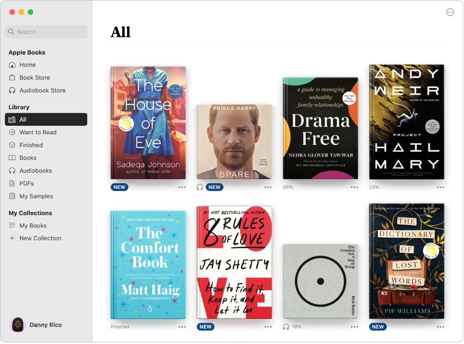
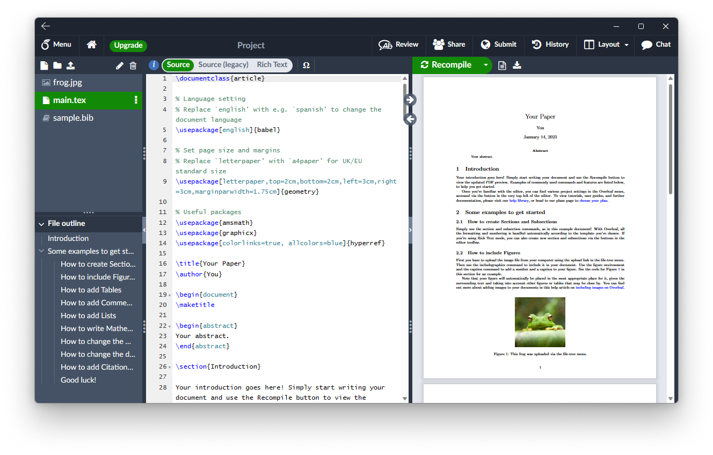
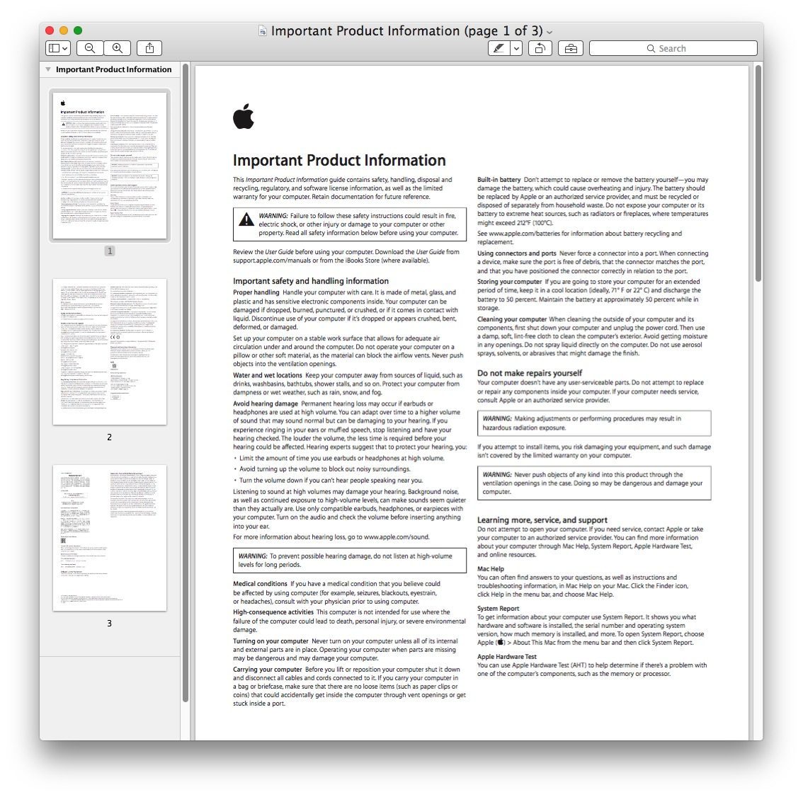

# LaTeXBooks
Idea: Overleaf (TeX Live) + Books (PDFViewer).

## Description
It is a Books/Notes (PDF) manager.

The main page should look like Apple Books (PDFs with covers).

Click on a PDF, and choose two modes: edit or view.

- Mode: edit
  - Edit the LaTeX source file on the left and compile & view the PDF on the right.
    

- Mode: view
  - Read PDF without editing.
    
